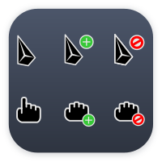
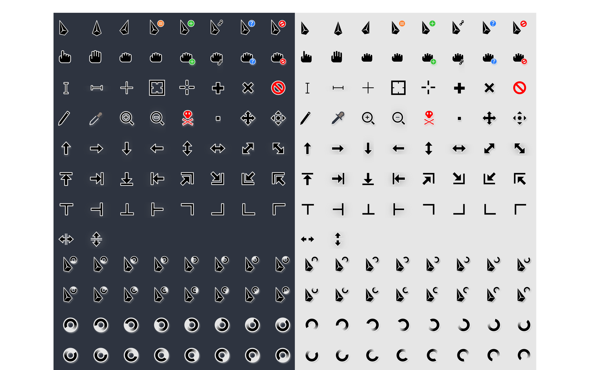

# Neonly



## Preview




## Installation

### Installer
To use the installer, clone the repository and go inside it.
```
git clone https://github.com/alvatip/Neonly
cd Neonly
```
Then, run the installer script. For local installation, use
``` 
./install.sh
```
And for system wide installation use:
``` 
sudo ./install.sh
```
### tar.gz file
Alternatively, you can use the tar.gz files located in the archive folder or in the release section and extract them to the adequate directory.</br>
For local installation:
```
tar -zxvf Neonly.tar.gz -C $HOME/.icons/
tar -zxvf Neonly.tar.gz -C $HOME/.icons/
```
For system-wide installation: 
```
tar -zxvf Neonly.tar.gz -C /usr/share/icons/
tar -zxvf Neonly.tar.gz -C /usr/share/icons/
```


### Set the cursor theme
There are various way to set this (or another) cursor theme.</br>
You will find all the needed informations on this [ArchWiki](https://wiki.archlinux.org/title/Cursor_themes#GNOME)

### Uninstallation
If you installed it locally, run this command in your terminal: 
```
rm -r $HOME/.icons/Neonly*
```
And if you installed it system-wide use:
```
sudo rm -r /usr/share/icons/Neonly*
```
## Other ressources
[Nordzy](https://github.com/alvatip/Nordzy-icon) icon theme. </br> 

##  Issues

If you have any issues, report them [here](https://github.com/alvatip/Neonly/issues), I will be happy to help you!

##  How can I help ?

* By giving a **star** or **follow** on GitHub.
* By **rating** it on Pling

## Licence

GNU General Public Licence v3.0.


